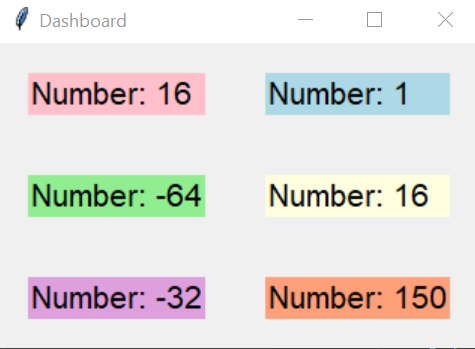
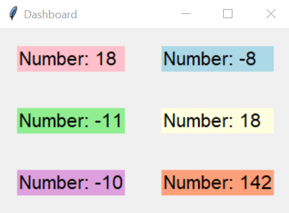

# Multi-Threading-Random-No-Dashboard
Display random numbers generated parallely by using multi-threading :)

* Bulit with Python.
* Tkinter GUI Dashboard which displays random numbers which change with time.
* The numbers are generated parallely with Multi Threading.

Screenshots:

After some time, the numbers on dashboard are:

